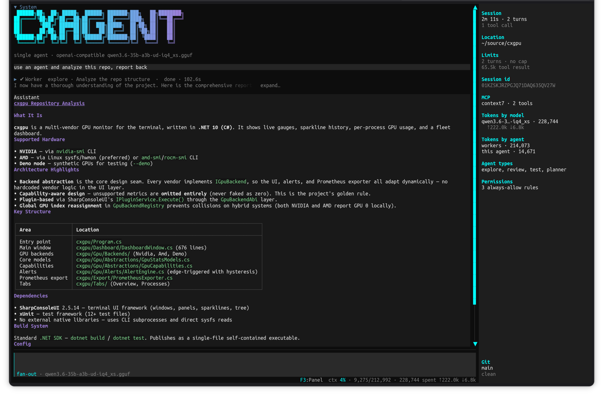

# CXAgent

<div align="center">

[](LICENSE)
[](https://dotnet.microsoft.com/)
[]()

</div>

<div align="center">
  
  <br>
  <sub>A worker agent explored the repo and reported back — 214,073 of the session's tokens spent
  inside the child, and 4% of the parent's context used.</sub>
  <br><br>
  <sub><b><a href="docs/screenshots/">See it working →</a></b> — one session closing three features in
  another repo, with the mistakes left in.</sub>
</div>

**A terminal AI coding agent built on [SharpConsoleUI](https://github.com/nickprotop/ConsoleEx).**

<div align="center">

### If you find CXAgent useful, please consider giving it a star!

It helps others discover the project and motivates continued development.

[](https://github.com/nickprotop/cxagent/stargazers)

</div>

Give it a goal in plain language. It reads your files, works out what to change, and changes them —
in one context, with the real bytes in front of it. Anything outside your working folder asks first.

Bring your own model: Ollama, any OpenAI-compatible endpoint, or Anthropic.

**Say it. Watch it work.**

> **Building your own?** Everything under the terminal ships as
> [**`CxAgent.Core`**](cxagent.Core/README.md) — sessions, agents, tools, sub-agent delegation,
> permissions and MCP, with no UI dependency. cxagent is one consumer of it;
> [a Spectre.Console front end](cxagent.Core/examples/SpectreAgent) is another, in a hundred lines.
>
> ```
> dotnet add package CxAgent.Core
> ```

## Quick Start

**Option 1: One-line install** (Linux/macOS, no .NET required)
```bash
curl -fsSL https://raw.githubusercontent.com/nickprotop/cxagent/master/install.sh | bash
cxagent
```

**Windows** (PowerShell)
```powershell
irm https://raw.githubusercontent.com/nickprotop/cxagent/master/install.ps1 | iex
```

**Option 2: Build from source** (requires .NET 10 SDK)
```bash
git clone https://github.com/nickprotop/cxagent.git
cd cxagent
./build-and-install.sh
```

On first run a setup wizard asks for a provider and model. Configuration is written to
`~/.config/cxagent/config.json` — it is never stored in the repository.

## What it does

Run it in the folder you want to work in, and type what you want:

```
add an overflow guard to EstimateOutputLength in HexEncoder.cs
```

It reads the file, finds the method, and edits it in place — matching the surrounding indentation
and style, because it is looking at the actual text rather than reconstructing it from memory.

### Tools

| Tool | Purpose |
|------|---------|
| `read_file` | Read a file, or a line window of it (`offset`/`limit`) |
| `write_file` | Write a whole file |
| `replace_in_file` | Replace an exact passage, leaving the rest untouched |
| `glob` | Find files by path pattern, e.g. `**/*.cs` |
| `grep` | Search file contents, literal or regex |
| `run_shell` | Run a command |
| `http_request` | Call an HTTP endpoint |
| `web_fetch` | Read a web page as text, markup stripped |
| `skill` | Load a skill's instructions on demand |
| `todowrite` | Keep a task list across a long job |
| `ask_user` | Ask the user questions — options with descriptions, several per call |
| `agent` | Delegate a job to a sub-agent (fan-out mode) |

**One name per tool, and no aliases.** Several of these have been renamed — `glob` was
`list_files`, `grep` was `search_files`, `agent` was `spawn_agent` then `task`, `ask_user` was
`question`. Each old name was accepted for a short window afterwards so a conversation resumed across
the change would not fail on a name it had seen in its own history. Those windows are closed: a call
under an old name gets `no such tool`, with the current names listed beside it.

`todowrite` keeps its unusual spelling deliberately — it is what Claude Code calls it, and models
distilled from it recognise the exact string.

### Permissions

Reading and writing inside the working folder is free, and so are commands that can only look —
`ls`, `cat`, `grep`, and `cd` into the folder before one. Anything that can write, and anything
outside the folder, stops and asks with **Allow once**, **Always allow**, or **Deny**.

**"Always" grants the command's NAME, not the exact string.** Approving `git status` stores
`git status*`, so the next `git status --short` runs — while `git push` still asks, because a
subcommand is part of what names a command. The prompt shows the rule it would write before you
grant it.

Grants are remembered per folder, and a folder is identified by more than its path: delete a folder
and recreate it, and its old grants do not apply to the new one.

### Sub-agents

**Fan-out is the default.** The agent can delegate a job to a sub-agent: a second agent with its own
context, its own conversation, and its own compaction. It runs, returns one message, and stops.

What that buys is room. A search that reads thirty files to answer one question fills a context with
material nobody needs afterwards — delegated, the parent keeps the conclusion and not the file dumps.
Measured on a real repo: 23k characters in the parent instead of 213k, for the same answer.

A sub-agent's work is not shown in the transcript. It gets one row, showing live turns, context
occupancy and elapsed time; expand it to see what the child is doing, or its report once it has
finished.

`/mode agent single` turns delegation off for a session, `/mode agent fan-out` turns it back on, and
`--mode single` starts that way. Single mode's prompt is what shipped before sub-agents existed —
turning it off really does turn it off.

The axis is named because there is more than one, and `/mode` on its own reports every axis rather
than guessing which one you meant.

**`/mode edits`** decides when a file write happens without asking. `accept-edits` — the default —
keeps writes inside the working directory silent and asks everywhere else; `always-ask` prompts for
every one. **Shift+Tab cycles it** from the composer. It names what cxagent already did rather than
granting anything new, and it cannot widen past your trust decision: on a folder you did not trust,
`accept-edits` still asks for everything, and the listing says so. Writes to `.git/`, `.vscode/`,
`.claude/` and `.idea/` keep asking regardless — a hook that runs on your next git command is not
what anyone means by "accept edits".

**Named types** say how a delegated job should be done. **Five ship with cxagent** and need no
configuration — including a **planner** that writes a plan to `./plans/` and reports what it decided,
and a **builder** that implements one and refuses to start without it. Their briefings live in the
program rather than in your config file, because a briefing is the contract a type keeps with the code
around it: cxagent names the file a planner must write, checks afterwards whether it is there, and the
builder refuses work that arrives without one. Config still chooses where a type runs (`provider`) and what
it may spend (`maxTurns`), and any name cxagent does not ship is entirely yours, briefing and all.
See [CONFIG.md](CONFIG.md) for the `agents` block, and [COMMANDS.md](COMMANDS.md) for `/mode` and
`/stats`.

**Honest about the limits**, because they are the sort you would otherwise find out the hard way:

- **Delegation depends on your model, and what we measured is one model.** On a local
  `qwen3.6-35b-a3b`, it delegates readily when asked — say "use a sub-agent to…" and it will — and
  rarely on its own judgement, usually doing the work inline instead. A stronger model may well
  choose to delegate unprompted; we have not measured one. Treat the guidance as a starting point
  rather than a property of the tool.
- **Sub-agents in one message run concurrently**, and the parent waits for all of them before it
  answers. No child outlives the turn that started it — the message format requires every tool call
  to be answered in the same turn, so a background agent has nowhere to put its result.
- A sub-agent cannot spawn its own — not a rule it is asked to follow, a tool it is never given.
- **A briefing is a request, not a permission.** "Never edit files" in a type's briefing asks the
  agent not to; it does not remove the tool. Permissions are the mechanism that constrains an agent,
  and they apply to sub-agents exactly as they apply to the main one.

## Skills

Instructions the model loads **when it needs them**, instead of carrying them on every turn.

Put a `SKILL.md` in `.cxagent/skills/<name>/` with a `description` saying *when* it applies. Only the
name and description ride in the prompt; the body is fetched by a tool when the model decides a task
matches — so twenty skills cost a few hundred characters instead of sixty thousand.

```markdown
---
name: double-entry-posting
description: Use when adding or fixing ledger posting or balance logic in this
  repo. Covers house rules that are not obvious from the code.
---

Every posting must sum to exactly zero. Reject unbalanced transactions with
ERR-UNBALANCED in the message.
```

`/skills` lists what was found — and, more usefully, every `SKILL.md` that was **skipped and why**,
because a file with broken frontmatter is otherwise invisible: you wrote it, nothing happened, and
there was no error anywhere. The session panel shows which skills are currently in force.

Already have `.claude/skills/`? `ln -s .claude/skills .cxagent/skills` — the prose loads, and
cxagent's own permission gate still governs every tool call, so no `allowed-tools` grant comes with
it.

**Same caveat as delegation: whether a model reaches for a skill is a property of the model.** On a
local `qwen3.6-35b-a3b` it does — it announced *"this is a double-entry bookkeeping task, so let me
load that skill first"* and loaded it unprompted — but only after the prompt was changed to say
explicitly that reading the file directly is not the same thing. Before that, the model found the
`SKILL.md` with the file-listing tool and read it: the instructions arrived, and nothing else in
the session knew a skill was in force.

See [CONFIG.md](CONFIG.md#skills) for where they live and how shadowing works.

## Configuration

`~/.config/cxagent/config.json`:

```json
{
  "providers": {
    "local": { "kind": "ollama", "model": "qwen3:32b", "baseUrl": "http://localhost:11434" }
  },
  "defaultProvider": "local"
}
```

Provider kinds: `ollama`, `openai-compatible` (requires `baseUrl`), `anthropic`.

Set `contextWindow` on a provider when you know it — it is the denominator for the occupancy
readout and the trigger for compaction. Left unset, cxagent asks the endpoint at startup.

Optional blocks: `agents` for sub-agent types, `mcp` for MCP servers, `orchestrator` for caps.

**[CONFIG.md](CONFIG.md) is the full reference** — every block, where the file lives on each OS, what
else cxagent keeps in that directory, and how `AGENTS.md` / `CXAGENT.md` / `CLAUDE.md` are resolved.
[`config.sample.json`](config.sample.json) documents every key inline, including what each one's
absence means.

**[ROADMAP.md](ROADMAP.md)** is what is built, what is next, and what was tried and removed.

## Keys

| Key | Action |
|-----|--------|
| `Enter` | Send. During a running turn, queues instead — several queued messages go as one prompt |
| `Esc` | Stop the running turn. Anything queued goes back into the composer rather than being lost |
| `F1` | Help |
| `F3` | Session panel (show / hide / automatic) |
| `F4` | Put the cursor back in the composer |
| `F5` | Settings |
| `Shift+Tab` | Cycle the edit mode — see [COMMANDS.md](COMMANDS.md) |
| `Ctrl+Q` | Quit |

Commands are typed in the composer — see [COMMANDS.md](COMMANDS.md).

## What this thing actually does to your machine

Read this once. It is short, and every line of it is something the software genuinely does.

**It edits your files.** Inside the working folder it writes without asking — that is the point of
it, and it is why you should run it in a git repository with your work committed. `git diff` is the
review step. There is no undo inside cxagent.

**It runs shell commands.** Anything outside the working folder, and every shell command, asks first
— **Allow once**, **Always allow**, or **Deny**. "Always" is remembered per folder. Read what you are
approving: the command is shown in full, and *"always allow"* means the next one like it will not
ask. A model can propose a command that deletes things, and if you approve it, it runs.

**It spends your money.** Every turn is a request to whichever provider you configured, and a
sub-agent is a whole second run of turns. A single delegated search can cost several hundred thousand
tokens. The session panel shows the running total and the parent/worker split, `/stats` shows what
past sessions cost and which tools fill the context, and `orchestrator.maxTurns` stops a request
after a set number of turns. **A turn cap bounds iterations, not spend** — one turn that reads a
large file costs more than ten that do not, so it is a backstop against a runaway, not a budget. If you point cxagent at a paid API, **you are paying for what
it does**, including work that turns out to be wrong.

A measured example, on a local model where the cost was only electricity: one evening of six sessions
came to roughly two million input tokens, because every turn re-sends the whole conversation and one
sub-agent made ninety-five web requests before its turn cap stopped it. On a metered API that is real
money for a result that was partly wrong.

**It talks to whatever you configure.** Your prompts, your file contents and your shell output go to
your chosen model provider, and to any MCP server you have enabled. What they do with it is between
you and them.

**A sub-agent is an agent.** It has the same tools and the same permission gate as the main one.
A type's briefing — "never edit files" — is a request written into its prompt, not a sandbox. Models
do not reliably follow instructions they are given. **Permissions are the mechanism that constrains
an agent; prose is not.**

**Nobody is responsible for the results but you.** cxagent is provided as-is under the MIT licence,
with no warranty of any kind. The authors are not liable for lost work, deleted files, broken builds,
leaked secrets, provider bills, or anything an agent does with the access you granted it. Review the
diff. Keep backups. Do not run it against anything you cannot afford to have changed.

## Uninstall

```bash
curl -fsSL https://raw.githubusercontent.com/nickprotop/cxagent/master/uninstall.sh | bash
```

```powershell
irm https://raw.githubusercontent.com/nickprotop/cxagent/master/uninstall.ps1 | iex
```

## The cx family

[cxfiles](https://github.com/nickprotop/cxfiles) · [cxpost](https://github.com/nickprotop/cxpost) ·
[cxlog](https://github.com/nickprotop/cxlog) · [cxnet](https://github.com/nickprotop/cxnet) ·
[cxgpu](https://github.com/nickprotop/cxgpu) · [cxshell](https://github.com/nickprotop/cxshell)

## License

MIT — see [LICENSE](LICENSE).
