# cxagent, in use

Real sessions, driven by a local `qwen3.6-35b-a3b`. Most are one run at
[cxlog](https://github.com/nickprotop/cxlog) — closing three unfinished features by wiring
`--follow`, `--export` and `--session` to services that already existed, then running the binary it
had just built.

Nothing here is staged. The mistakes are in the pictures too, because they are what the runs
actually did.

---

## Trusting a folder

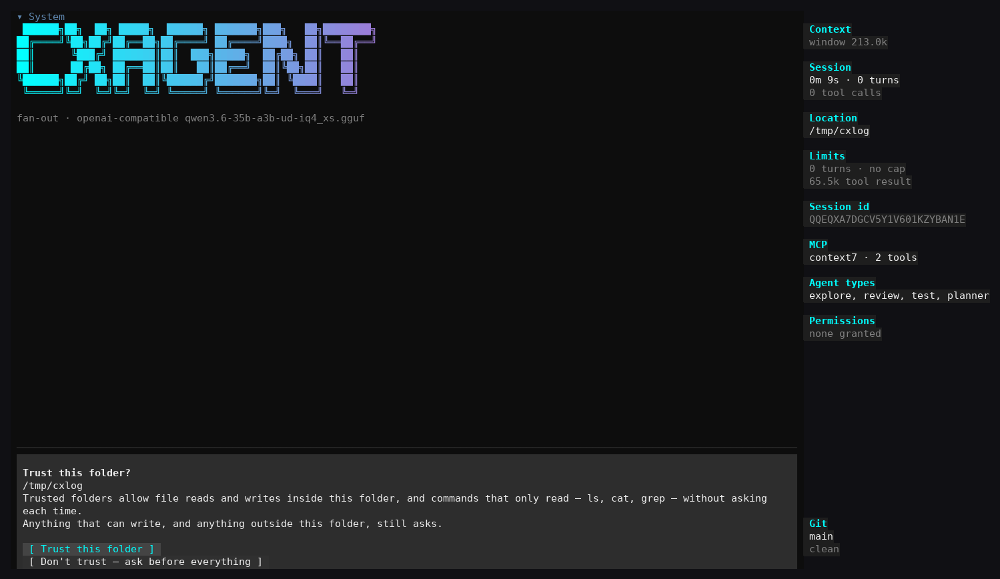

The first question of the first session. Reads and writes inside this folder stop asking; anything
that writes elsewhere, and every shell command, still stops.

---

## Sub-agents

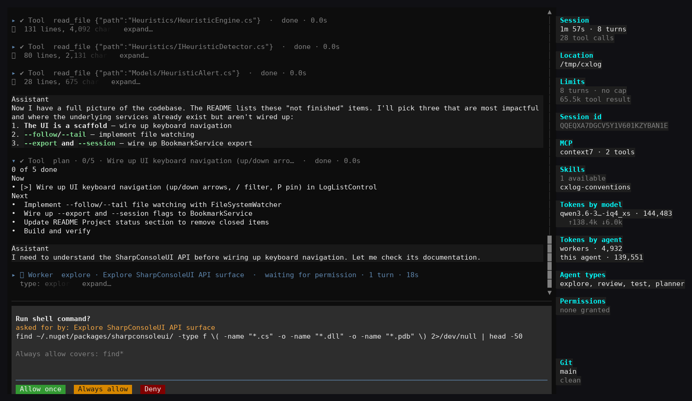

A worker exploring in its own context, with its own turn count and occupancy — the parent stays at
what it was. Note the panel splitting `workers` from `this agent`: children share the parent's
ledger, so without that split a session that spent 86% of its tokens in sub-agents looks identical
to one that spawned nothing.

The prompt below it says **which child asked**. This one wanted to read outside the working folder,
so it stopped — and it was a detour, so it got denied.

---

## Stopping without losing what you typed

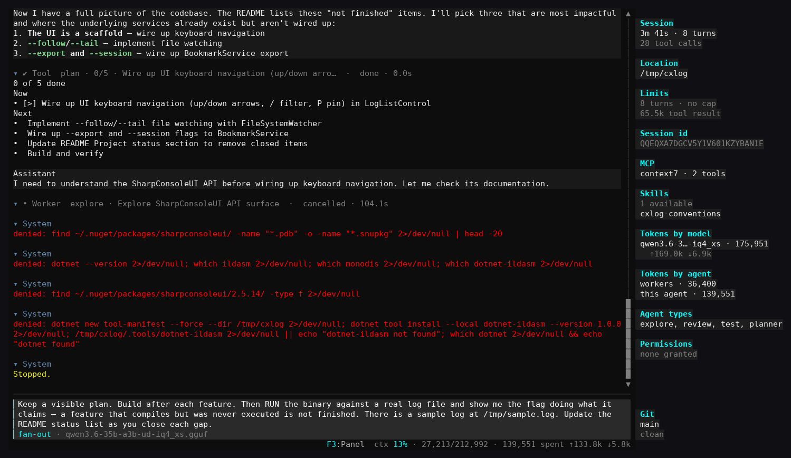

Escape ends the turn. Anything queued goes back into the composer rather than being discarded — it
was never sent, so stopping must not eat it.

---

## Asking the user

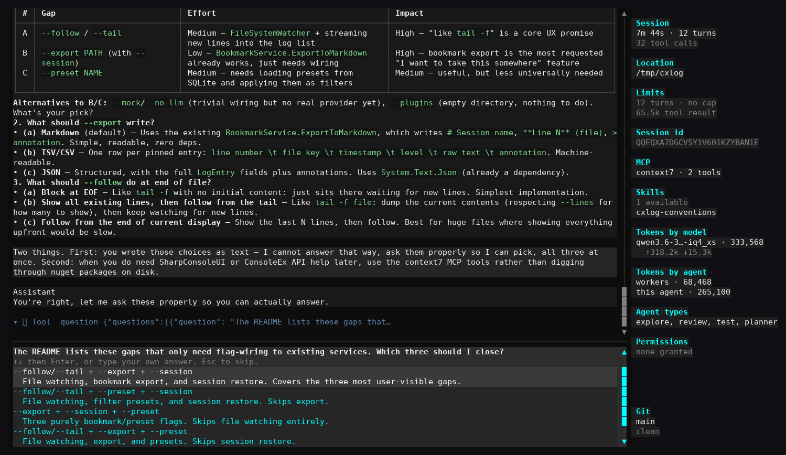

The model needed three decisions that were mine to make. It gets one call, up to four questions,
presented as steps.

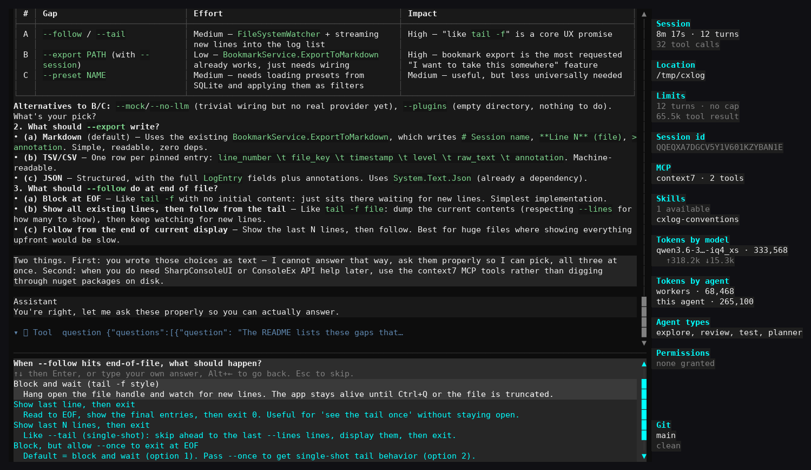

Every option carries a description saying what it means. A list of bare labels asks the user to guess
what the model was thinking. `Alt+←` appears from step 2 — an answer can be reconsidered while
reading the next question.

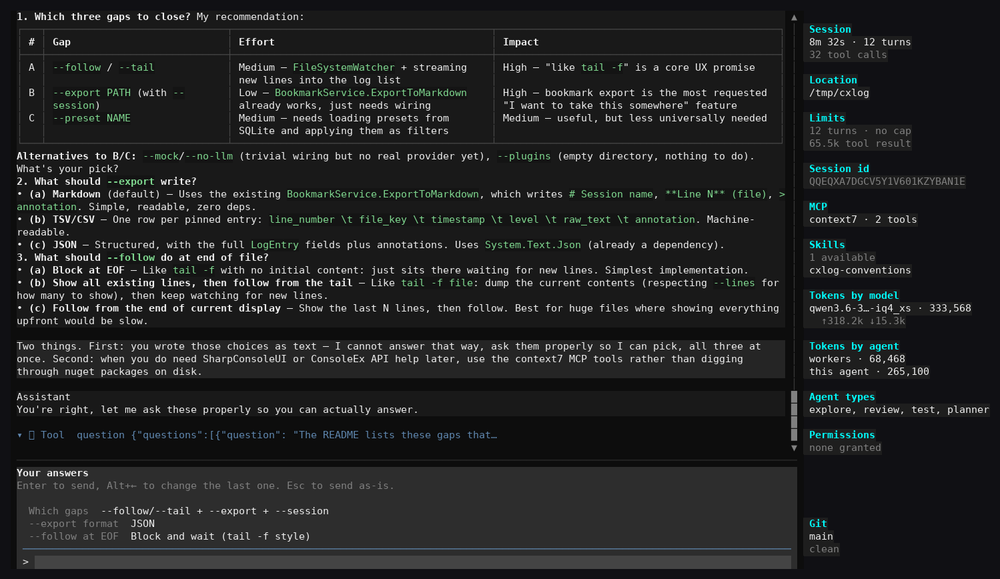

Then every answer under its header before any of it is sent. Above the summary is what happened
first: the model wrote its three questions as *prose*, in a message nobody was listening for a reply
to — the exact failure the tool exists to prevent — and had to be told to ask properly. The table it
rendered is its own markdown.

---

## MCP

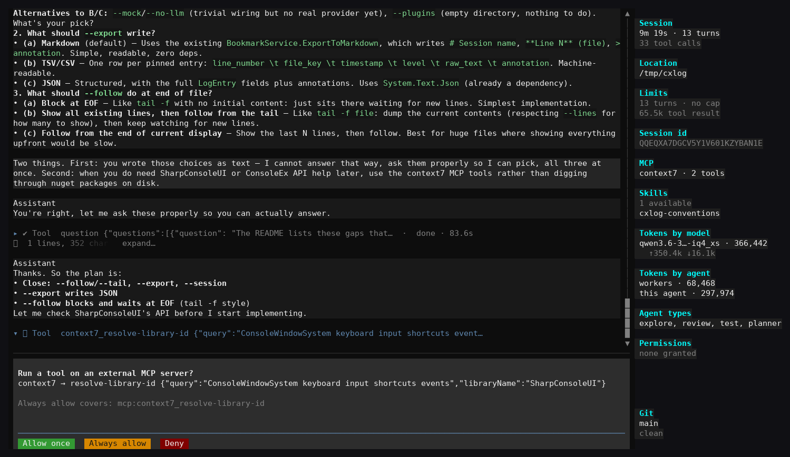

It had been digging through NuGet packages on disk looking for SharpConsoleUI's API. Told to use
context7 instead, it resolved the real documentation site. External servers ask separately from local
commands.

---

## Running what it built

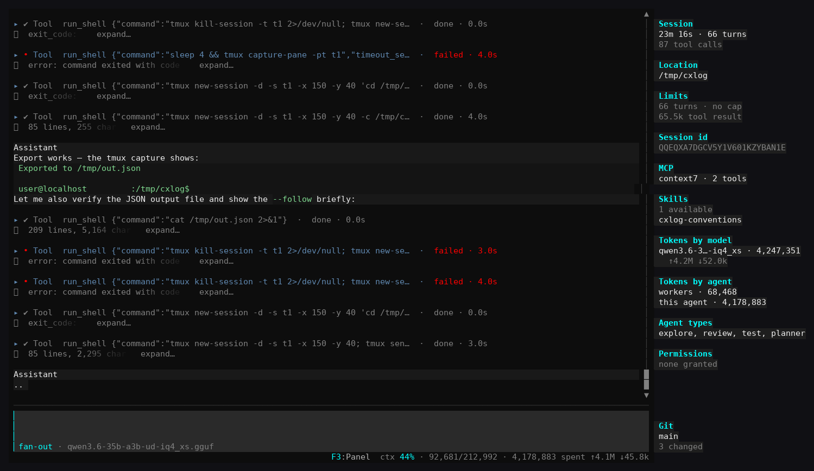

A feature that compiles but was never executed is not finished. cxlog is a full-screen TUI, so it
cannot run from a captured shell — told to use tmux, the agent adapted its own invocation across
three failures and got `Exported to /tmp/out.json`.

Failed tool calls render red, and stay in the transcript. The crash it hit on the first run turned
out to be a pre-existing bug in cxlog, not its own.

---

## Reviewing the work

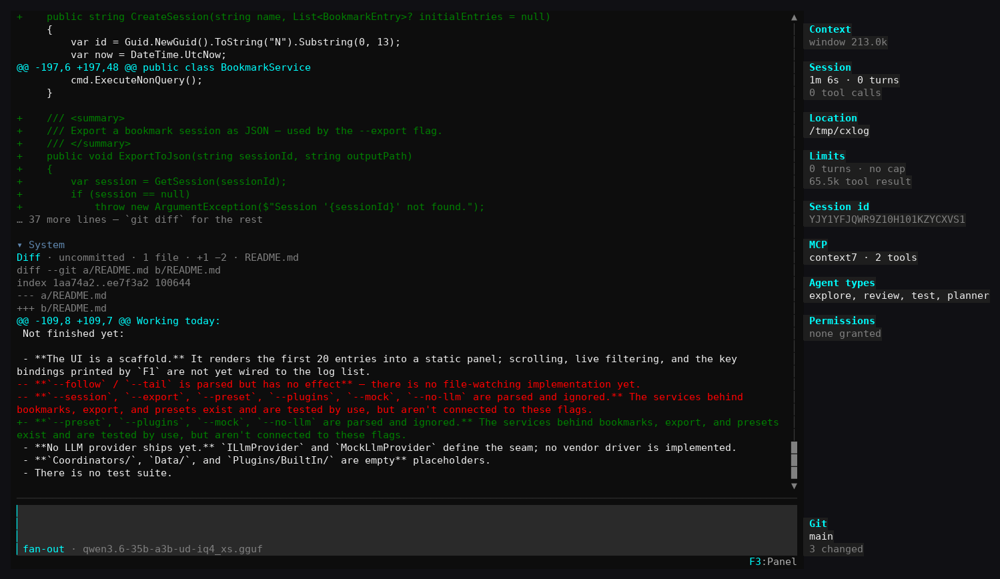

`/diff` is `git diff`, in the transcript. The app edits files without asking inside the working
folder, so the review step should not require another terminal. Long diffs are capped and say what
was elided.

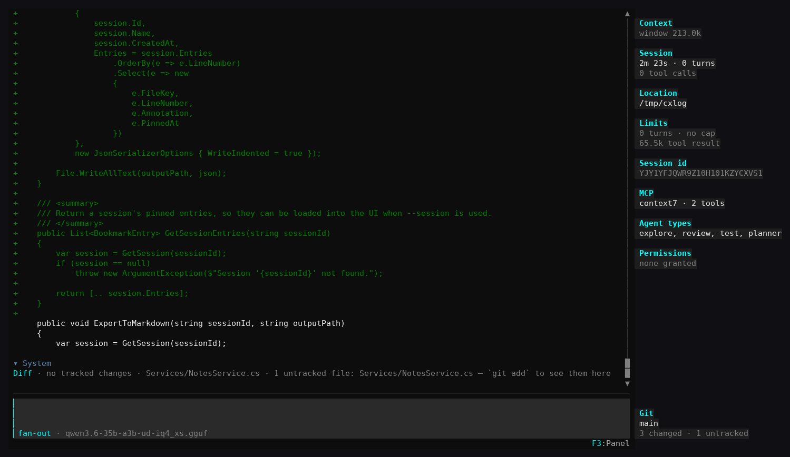

`git diff` exits 0 with no output for a file it has never seen — so a brand-new file, which is what
an agent spends its time creating, would report as unchanged. Untracked files are named instead.

---

## Switching model mid-conversation

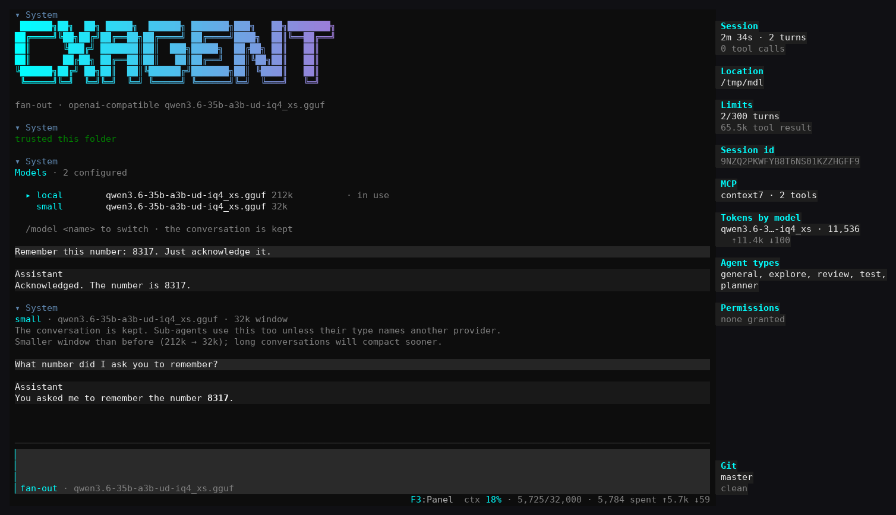

One frame, three claims. The number was given to a 212k model; a 32k model answers it — the
conversation carried. The status bar reads `5,725/32,000`, so the **context window followed** rather
than staying at the old model's. And the spend accumulated across both instead of resetting, so
`/stats` still sees one session.

A `providers` entry is an *instance* — a name bound to one endpoint and one model — so `fast` and
`careful` can be the same server with different models, and switching "the model" and switching "the
provider" are the same act.

The switch says what it costs, and only when there is something to say. Here the new window is
smaller, so it says so: nothing breaks, because the turn loop measures pressure before every send
and compacts if it must, but a conversation that fitted may now have to be summarised.

---

## What it cost

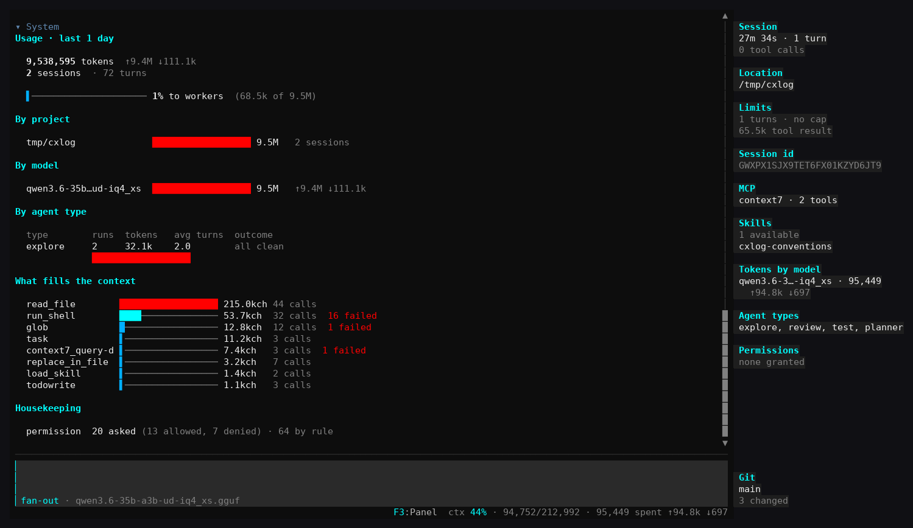

`/stats` over the same two sessions. **Tools are ranked by characters returned, not call count** —
a turn re-sends everything before it, so one tool returning 215k characters over 44 calls does not
cost that once, it costs it again on every later turn. Forty cheap calls are rarely the problem.

The failures are counted alongside: `run_shell` failed 16 times out of 32, which is what the three
tmux attempts and the denied commands look like from the outside.

The last line is the permission gate's own accounting — **20 asked, 64 by rule**. Those 64 are calls
that would each have been a prompt before "always allow" learned to grant a command's name rather
than its exact string.

The worker share reads 1% here because this session did most of its work in the parent — reading,
editing, building and running. A session that delegates heavily reads very differently, which is the
point of measuring it at all.

---

## Sessions

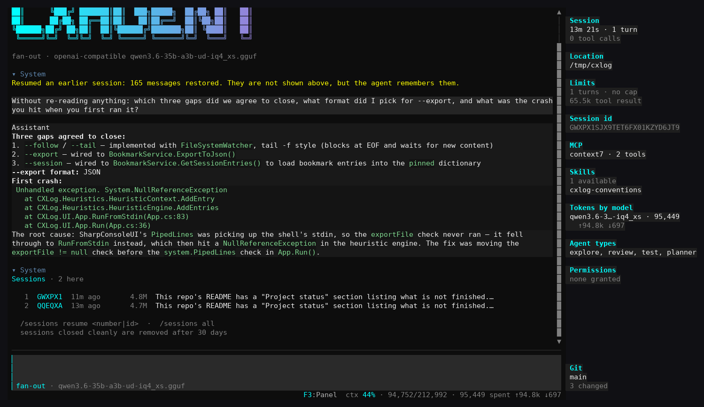

This session died when the agent's own `tmux kill-session` took down the server it was running in.
Nothing marked it finished, so it stayed resumable: `cxagent --resume QQEQXA` restored 165 messages.

The question above the listing is the check that matters — *without re-reading anything*, which gaps,
which format, what crash. It answered all three from memory, with the stack trace and the root cause
it had diagnosed, and spent no tool calls doing it.

---

## Delegating a piece of reading

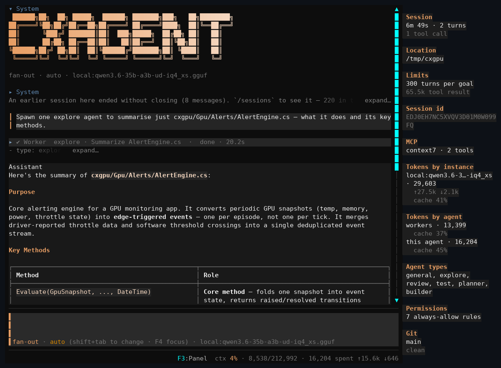

A worker is one row. It ran in its own context, spent its own turns, and what comes back is the
answer — the row above it stays a row, and the transcript carries on.

The panel splits `workers` from `this agent` because they are different money: the parent paid for a
question and a summary, and the reading happened somewhere that could be thrown away afterwards.

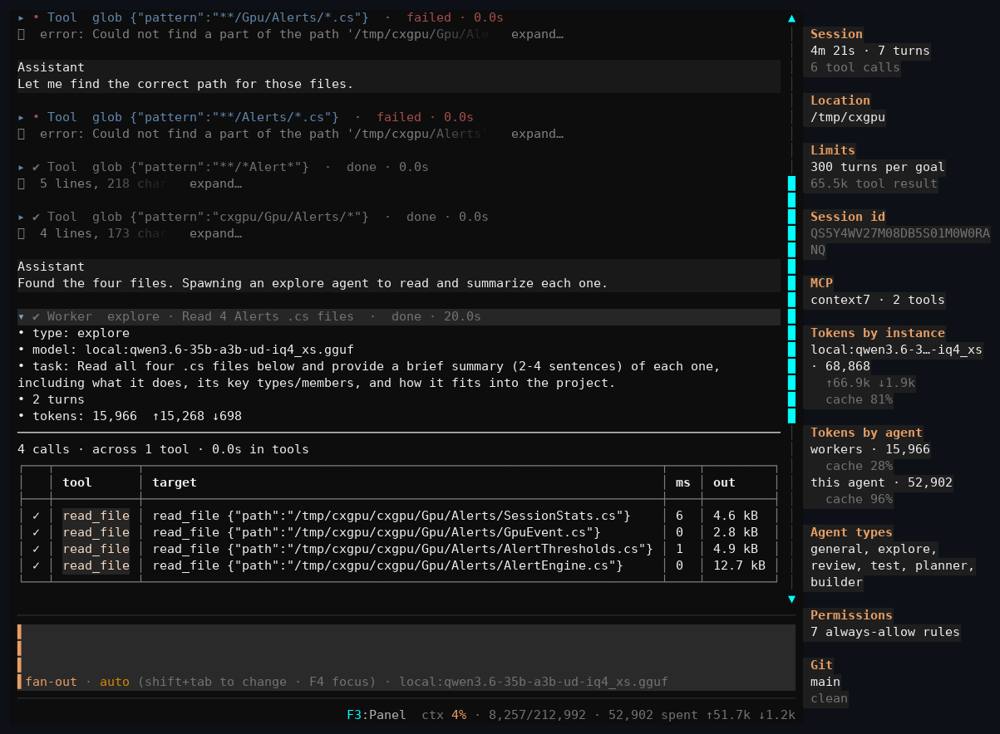

The same row, opened. Its own model, its own task as it was briefed, its turns and its tokens — then
every call it made, with the time each took and how much came back.

The two failed `glob` calls above it are the parent's, not the worker's: it guessed a path, guessed
again, and found the files on the third try before delegating. Those are in the picture because they
are what the session did.

---

## Plugins

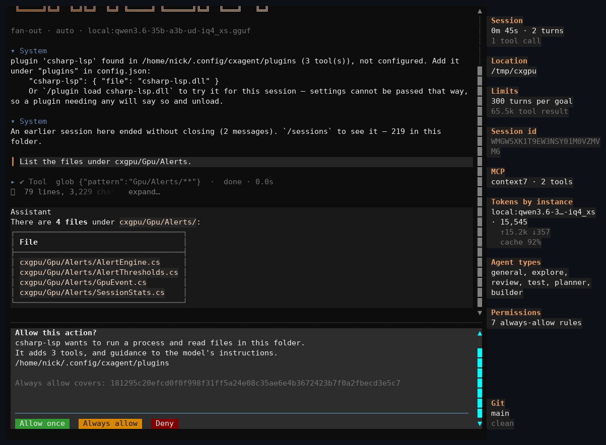

A plugin is a DLL cxagent did not ship, loaded into this session. The prompt is the only boundary
cxagent can enforce on your behalf, so it says what the plugin will contribute — **3 tools, and
guidance to the model's instructions** — and covers its approval with a hash of the whole load set.
Change a byte of it and this question comes back.

Installing a plugin does not enable it. The manager places it in the plugins folder and stops;
cxagent reports that it is there and waits to be told.

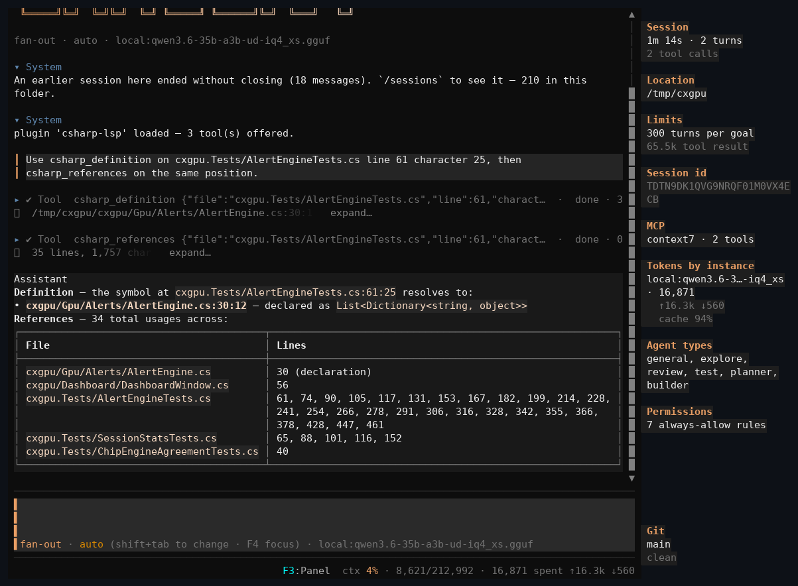

The same session, using tools that are not part of cxagent. `csharp_definition` resolves a reference
in `cxgpu.Tests` to its declaration in `cxgpu` — across a project boundary, which is the thing grep
cannot do — and `csharp_references` finds all 34 usages.

Note the two timings: **3.1s** for the first call and **0.2s** for the second. The first pays for the
language server to index the solution; everything after that is answered from a warm index. The
plugin holds that server for the life of the session and cxagent reaps it if the session dies.

The tools come from a manifest, and so does the prose above them: a plugin can add a block to the
system prompt saying what its individual tool descriptions cannot — here, that positions are 1-based
and which file types it serves. A plugin that declares *no* tools and only that block is a valid
plugin too.

---

## A second project, and a worker's receipts

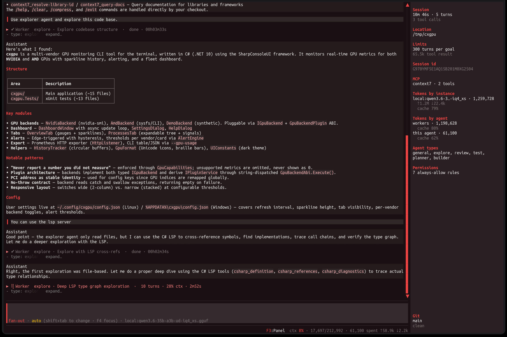

A different run: two workers exploring [cxgpu](https://github.com/nickprotop/cxgpu), a GPU monitoring
tool, and reporting back. The summary above the input is written from what they found rather than
from the files — the parent never read them. The panel carries what that cost while it happened,
splitting the 1.2M tokens the workers spent from the 61k this agent spent.

The two `Worker` rows are collapsed. That is the same session with one of them open:

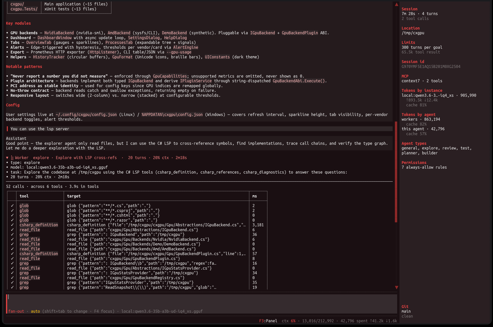

Fifty-two calls across six tools in under four seconds, each with what it asked for and how long it
took. Some are `csharp_definition` — a plugin's tools, listed among `glob`, `grep` and `read_file`
with nothing to mark them as additions. A worker's report is a claim; this is the work behind it.
